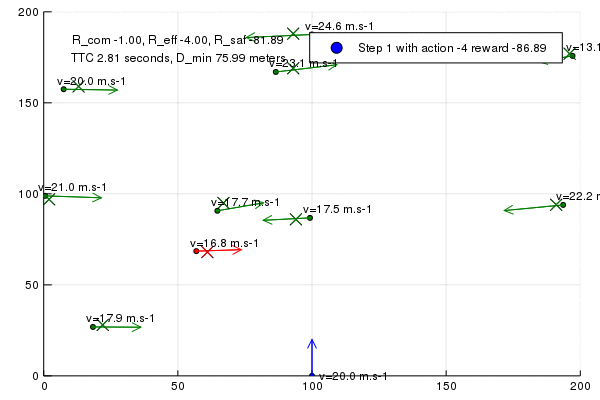

# ACT: Anti Collision Tests framework

[//]: # (Image References)
[image1]: ./img/act.gif

     
      Anti Collision Tests

  
The source of uncertainty will be mainly related to other agents driving models: IDM driving models https://en.wikipedia.org/wiki/Intelligent_driver_model with parameters that are not known precisely.
